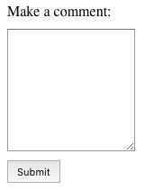

# Exercise 2: Labels

With the HTML tags we have seen so far, we can build a fully functioning form. We now need to make it user-friendly.

For this, we will add a **label** for each field:

`<label for="target-id">Some text here</label>`

Labels are used to tell the user what data they are expected to enter in that field. The value of the `for` attribute is the `id` of the field to which the label makes reference. For example:

```
<form method="POST" action="/checkout">
	<label for="first-name">First Name:</label>
	<input type="text" name="first-name" id="first-name">
	<input type="submit" value="Submit">
</form>
```

The `label` in the example above is linked to the `input` field with id `first-name`.

To the user it will look like this:



## Have a go!

The form from exercise 1 works well but it is not user friendly. How does anyone know what they are supposed to enter in each field?

1. Open exercise 2's `index.html` and add the form you created in [exercise 1](../1-input-fields/index.html) where it says `<!-- Your exercise 1 form goes here -->`.

2. Add a label to all the input fields that need one.

3. (Optional) Make the form easier to read by displaying each label+input pair in its own line. There are several ways of achieving this, how would you do it? Have a think before Google-ing it!
